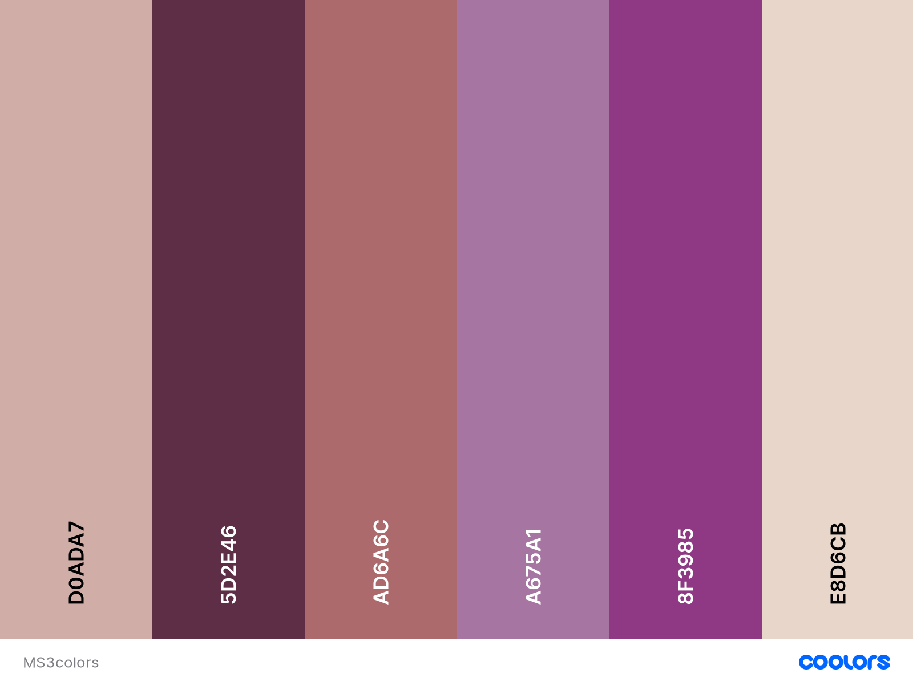

# Airline Fans 101

## Project Goals

For someone that used to work in the Airline industry that travels the world, and meeting different people onboard flights, it was always drilled into our minds that when someone travels from point A to point B, whether for business, reconnecting with family and friends, or wanting to see the world, or on a holiday… That journey experience and excitement begins the moment they step foot onboard that plane. 
So everything that we do in terms of service and product offering will make or break the customer or passengers experience of the airline. 
Although not every passenger or customer may have that excitement being onboard, as they would like to just arrive to their destination in comfort, but there are a select number who takes their interest in airline travel to the next level. 
They are what we call the “Aviation Geeks” or “AvGeeks.” They love everything about the aircraft. They would have extensive knowledge on the aircraft types, onboard service, airline meals specific to the route, aircraft seats to knowing which seat numbers are the best for take off or landing. 
They would even collect anything that is offered to them onboard such as airline magazines, amenity kits, to even plastic cups with airline logos. With the power of social media, you could also spot an AvGeek who will take lots of photos of airline window views to taking pictures of their airline meal, or the millions of postings about the newest Airbus or Boeing aircraft models.
Even before working as a Flight Attendant, I already considered myself as an AvGeek! This is one of the reasons why I created this project, because of my love for the airline industry, and also have a platform for fellow Aviation Geeks or Airline Fans like myself, share their inflight experience or their favourite aircraft or airline. 
Buckle up! And get ready for take-off! And get yourself immersed in the world of Airline Fans 101! 

# UX 

## User Goals

*	The website needs to work and is responsive when using a laptop/desktop, tablet or mobile devices. 
*	Has the facility to register and login with clear instructions provided when necessary. 
*	The site is appealing and relevant to the theme which is all about airlines.
*	A site that creates a community of airline and aviation lovers to share their experiences and what they loved about their inflight experience. 
*	This site will also give users in general an insight on a specific airline on what they are offering on their flights.

## User Stories

As a User:

*	I want an online community of airline fans created in one website.
*	I want to have the ability to create my own account with ease. 
*	I want to be able to log in and log out after creating an account.
*	I want to be able to read any articles shared by other airline or aviation fans. 
*	I want to be able to share my airline or aviation experience and for others to see it, and able to write my experience and upload photos without any limit of the number of shared posts I create.
*	I am able to go back and edit what I’ve shared.
*   I am able to delete what I’ve shared whenever I can.
*	I have a dashboard facility page personalised for me so I can see what I’ve shared and what others have shared.
*	I want a site that has several social media pages that I can follow and reach out to them through direct messages. 
*	I want a website that is user-friendly. 
*	I want the site to making the process of adding, editing, logging in, registering and deleting to be easy for me. 

Site owner goals

*	To have a website that will catch the interest of any airline or aviation fans to share their stories or experiences, and also following our social media pages. 
*	To make the site personal for the user to share information about their airline experience or their love for the airline.
*	To have a site with a great functionality that makes them connect with other users who shares the same interest and love for the airline or aviation, through reading what has been shared by other users. 

## User Requirements and Expectations

Requirements

*	Easy to navigate using buttons
*	A profile page that has a functional overview that will have an element of appeal
*	Easy way to add information to be shared on the profile dashboard
*	Easy way to log in and log out to the dashboard
*	Being able to delete or even edit a shared post.

Expectations

*	When there are multiple shared posts, it should be easy to navigate between these posts
*	A profile page that all the information which is relevant is visible 
*	It is easy to add posts and the ability to add photos for relevant posts created

## Colour Theme 
I used [coolors](https://coolors.co/d0ada7-5d2e46-ad6a6c-a675a1-8f3985-e8d6cb) for the colour theme of my project. 




## Fonts

I used a selection of [Google Fonts](https://fonts.google.com/). I selected the following: 

* Roboto
* Luckiest Guy
* Rammetto One

## Technologies Used 

Languages used

* HTML
* CSS 
* JS
* Python

Libraries and Frameworks

* MaterializeCSS
* Font Awesome
* Google Fonts
* JQuery

Tools Used

* MongoDB Atlas
* Flask
* Heroku
* GitPod
* Jinja
* Werkzeug 
* Randomkeygen

## Deployment

Setup

* In the IDE create an env.py file to store the sensitive data and hidden using environment variables.
* Create a .gitignore file for files to be ignored when pushing to gitHub.
* Add env.py file and auto generated __pycache__/ file to the .gitignore file.
* Default environment variables setup for env.py is as follows:
* Import os
* Blank Line
* os.environ.setdefault("IP", "Added by user")
* os.environ.setdefault("PORT", "Added by user")
* os.environ.setdefault("SECRET_KEY", "Added by user")
* os.environ.setdefault("MONGO_URI", "Added by user")
* os.environ.setdefault("MONGO_DBNAME", "Added by user")

Heroku Deployment

* Add required files for Heroku to run the app. Create requirements.txt and Procfile:

```
$ pip3 freeze --local > requirements.txt
$ echo web: python app.py > Procfile
```

* Push these 2 files to gitHub.
* Login to Heroku.com and from dashboard go to "new" - "create new app" and add details of app to create.
* Setup automatic deployment by selecting "Deploy" tab then under "Deployment Method" - "connect to GitHub".
* Add gitHub repository name "Car-Owner-Reviews-MS3-Project" and connect to app.
* Go to settings tab for the app and select "Reveal Config Vars".
* Add in the variables from the env.py file.
* Back under "Deploy" tab, under "Automatic Deploys" select "Enable Automatic Deployment"
* Under "Manual Deploy" select "Deploy Branch"
* After Heroku has built the app it will be successfully deployed. Select "View" to launch.

Cloning on GitHub

* Login to GitHub.com.
* Open my repositories.
* Click "Code" then under "Clone" copy the link with the HTTPS URL.
* Go to the terminal in your IDE environment.
* Change the working directory to where you want the clone to be saved by typing cd and the name of the directory.
* Type git clone and paste the copied HTTPS URL.
* After pressing enter the clone will be saved to your chosen directory.
* Local Deployment On Gitpod
* Follow steps above to clone repository.
* Install the libraries from the requirements.txt, in the terminal type - pip3 install -r requirements.txt.
* Follow the "setup" steps above to create env.py and .gitignore files for the hidden environment variables.
* The app can now be opened in a browser by typing in the terminal: python3 app.py.


## Credits

* I’d like to thank my mentor Simen Daehlin for his support and help for me to come up with this project.
* I created this project in a very short span of time. I draw my inspiration of this project from our relevant modules at the Code Institute which has helped me create my own ideas for this project. 
* I’d like to thank the Slack community and the tutor support team who always responded to me when I was stuck with something. 


